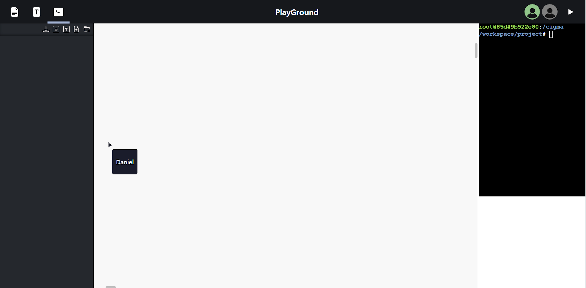
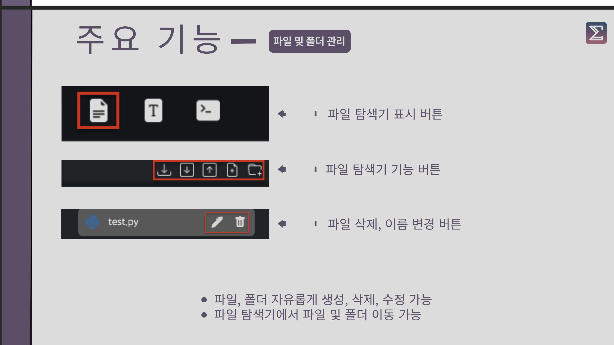
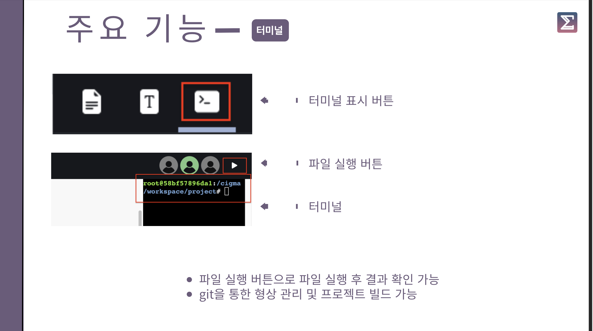
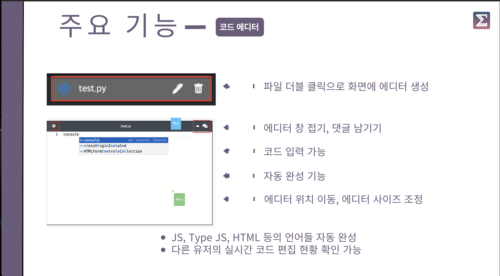

# IDE 사용방법

 

## 파일 탐색기

1. 프로젝트 다운로드
2. 전체 폴더 토글 열기
3. 전체 폴더 토글 닫기
4. 새 파일 생성
5. 새 폴더 생성

 

## 헤더 바

1. 파일/폴더 트리 사이드 표시 on/off
2. 텍스트 box 입력 on/off
3. 터미널 사이드 표시 on/off
4. 팀이름 및 프로젝트 이름 표시
5. 접속 중인 사용자 표시
6. 실행 버튼
7. 터미널

 

## 코드 에디터

1. 코드 에디터 닫기
2. 코드 에디터 파일 이름
3. 코드 에디터 접기/열기
4. comment 표시 on/off
5. 코드 입력 부분

 

## 단축키 설명 및 키 사용방법

- space 키 누른 상태에서 drag : 워크스페이스 화면 이동
- ctrl 키 누른 상태에서 scroll : 워크스페이스 확대 / 축소
- shift 키 누른 상태에서 scroll : 워크스페이스 가로 스크롤
- t 키 : 텍스트 box 입력 모드 활성화
  - 워크 스페이스 클릭 : 텍스트 입력 box 생성
    - 텍스트 입력 후 외부 워크 스페이스 클릭 시 텍스트 box 생성
    - 내용이 없으면 텍스트 box 생성 안됨
  - esc : 텍스트 box 입력 모드 해제

 

## 워크 스페이스 관련 (메인)

- 텍스트 box 생성
  - 단축키 t 사용 관련 참고
  - 헤더의 텍스트 box 입력 버튼 클릭 후 워크 스페이스 클릭
    - 텍스트 입력 box 생성
      - 텍스트 입력 후 외부 워크 스페이스 클릭 시 텍스트 box 생성
      - 내용이 없으면 텍스트 box 생성 안됨
- 텍스트 box 수정
  - 기존에 생성된 텍스트 box 더블 클릭
- 텍스트 box 삭제
  - 기존에 생성된 텍스트 box 더블 클릭, 내용 제거 후 외부 워크 스페이스 클릭
- 코드 에디터 생성
  - 편집하고자 하는 파일을 파일 탐색기에서 더블 클릭
  - 코드 에디터는 지정된 위치에 생성됨
- 코드 에디터 삭제
  - 코드 에디터의 헤더 좌측 X 아이콘 클릭
- 코드 에디터 코드 수정
  - 코드 에디터의 에디터 영역을 더블 클릭 후 수정
- 코드 에디터 접기 / 열기
  - 코드 에디터의 헤더 좌측에 화살표 아이콘 클릭
- comment 입력 방법
  - 코드 에디터의 헤더 좌측 맨끝 아이콘 클릭 : 코멘트 창 표시
  - 코멘트 입력 영역 클릭 후 코멘트 내용 작성 후 enter

 

## 파일 탐색기 (좌측 사이드 바)

### 파일 / 폴더 생성

- 파일 생성
  - 탐색기 상단에 ‘파일 +’ 아이콘 클릭
  - 활성화된 파일 이름 입력창에 파일 이름 입력
    - 입력된 내용이 없을 경우 파일 생성 취소
    - esc 키 입력할 경우 파일 생성 취소
- 폴더 생성
  - 탐색기 상담에 ‘폴더 +’ 아이콘 클릭
  - 활성화된 폴더 이름 입력창에 폴더 이름 입력
    - 입력된 내용이 없을 경우 폴더 생성 취소
    - esc 키 입력할 경우 폴더 생성 취소

### 파일 / 폴더 이름 수정

- 파일 이름 수정
  - 수정하고자 하는 파일 우측에 연필 아이콘 클릭
  - 수정하고자 하는 파일 이름 입력
    - 입력된 내용이 없을 경우 파일 이름 수정 취소
    - esc 키 입력할 경우 파일 이름 수정 취소
- 폴더 이름 수정
  - 수정하고자 하는 폴더 우측에 연필 아이콘 클릭
  - 수정하고자 하는 폴더 이름 입력
    - 입력된 내용이 없을 경우 폴더 이름 수정 취소
    - esc 키 입력할 경우 폴더 이름 수정 취소

### 파일 / 폴더 이동

- 파일 이동
  - 파일을 클릭한 상태에서 원하는 위치에서 클릭 해제 (drag&drop)
- 폴더 이동
  - 폴더를 클릭한 상태에서 원하는 위치에서 클릭 해제 (drag&drop)

### 파일 / 폴더 업로드

- 파일 업로드
  - 파일을 클릭한 상태에서 파일 탐색기에 나타나는 Upload 위치에서 클릭 해제 (drag&drop)
- 폴더 업로드
  - 폴더를 클릭한 상태에서 파일 탐색기에 나타나는 Upload 위치에서 클릭 해제 (drag&drop)
  - 폴더 업로드 시 내부에 존재하는 모든 파일들이 업로드됨 (약간의 시간이 걸림)
  - 폴더 내부에 파일이 존재하지 않을 경우 업로드 안됨

 

## 터미널 (우측 사이드 바)

- 터미널 표시
  - 헤더 좌측의 터미널 아이콘 클릭
- 터미널 입력
  - 터미널 창 클릭 후 텍스트 입력

 

## 서버 포트

- 메인 포트 : 5000
